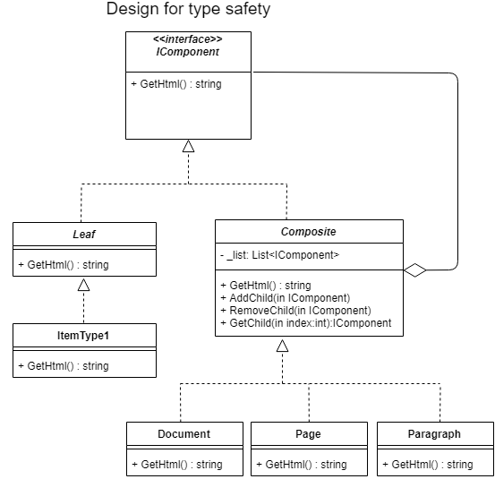

The Composite UML diagram in this example is

Where the results of the unit test are: 

'<doc>
  <pag>
    <para>
      <il>Lorem ipsum dolor sit amet, </il>
      <il>consectetur adipiscing elit.</il>
    </para>
    <para>
      <il>Nulla molestie nibh id dui fringilla bibendum.</il>
      <il>Quisque sed risus ut tellus varius</il>
    </para>
  </pag>
</doc>'
