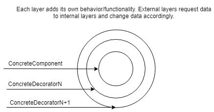
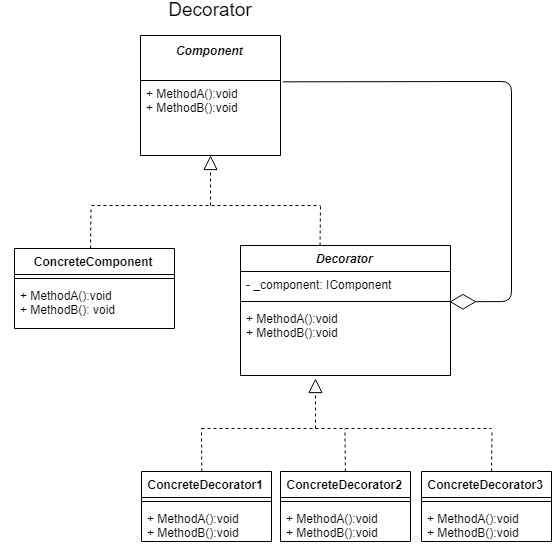

The decorator pattern attaches additional responsabilities to an object dinamically (at runtime). It is not necesary to define a set of responsabilities at compile time. It provides a flexible alternative to sub-classing for extending functionalities.

It is a wrapper that can be used to completely define new functionalities to a base object, modify the behavior/result of existing methods/functionalities or even block or restrict the use of existing functionalities (to deprecate functions/methods)

