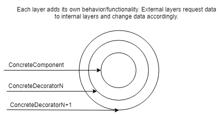

The decorator pattern attaches additional responsabilities to an object dinamically (at runtime). It is not necesary to define a set of responsabilities at compile time. It provides a flexible alternative to sub-classing for extending functionalities.

