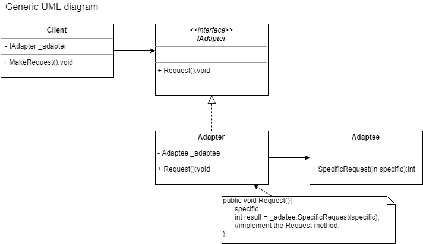

1. When to use it? The Facade pattern is .

2. Motivation. From the Single responsability principle, there may be many classes and to do a significant task, many of these classes have to called and the interaction becomes quite comples. In such scenario, one may create a facade that exposes specific behaviors/interaction of all these independant classes.

 
 

 
 
