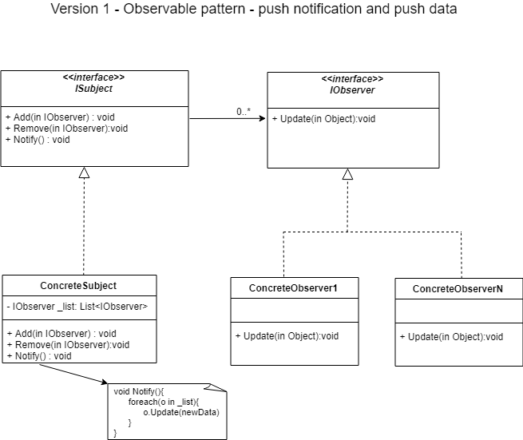
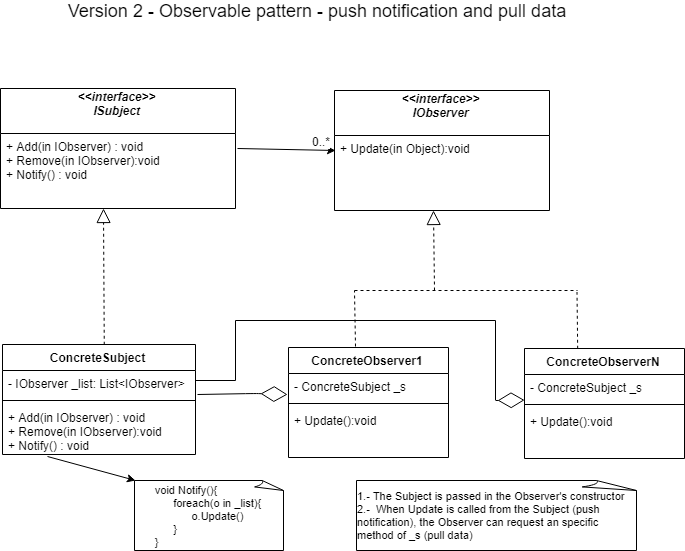

1.- When to use it? 
An object, called the subject, maintains a list of its dependents, called observers, and notifies them automatically of any state changes, usually by calling one of their methods.

It is mainly used to implement distributed event handling systems, in "event driven" software. Most modern languages such as <b>C# have built-in "event" constructs</b> which implement the observer pattern components.

 

 
 

 